# Google Mobile WebDev
see [Udacity](https://www.udacity.com/course/mobile-web-specialist-nanodegree--nd024) - [Google Web fundamentals](https://developers.google.com/web/fundamentals/)

### Table of Contents

1. [Responsive Web Design](#responsive-web-design)
2. [Responsive Images](#responsive-images)
3. [Accessibility](#accessibility)
4. [Offline First](#offline-first)
5. [ES 6](#es-6)
6. 
7. 
8. 
9. 
10. 
11. 

[Table of contents](#table-of-contents)
## Responsive Web Design
*Responsive web design responds to the needs of the users and the devices they're using. The layout changes based on the size and capabilities of the device. For example, on a phone users would see content shown in a single column view; a tablet might show the same content in two columns.*
### Pixels
- Screen Resolution / Hardware Pixel
- CSS pixel - Viewport
    - CSS=SR/DPR
- DPR - Device pixel ratio
    - DPR=SR/CSS

### Set Viewport
- `<meta name="viewport" content="width=device-width, initial-scale=1">`

### Relative width
- in Css
- `img, embed, object, video { max-width: 100%; }`

### Tap Target
- button should be 48px by 48px with 40px space
- in Css `min-width: 48px; min-height: 48px;`
- add `padding: 1.5em`

### Start Small
- prioritize content and add from Phone -> Tablet -> Laptop -> Desktop
- performance: how much Data for Phone

### Breakpoints
- choose breakpoints for different screen size
- `@media screen and (min-width: 601px) and (max-width: 992px){...}`

### Flexbox
- use `div class="container"` in html
- use `.container {display: flex;}` in css
- use `order:1 ; width:100%;` in css

### Patterns
- use responsive patterns
- fluid, etc
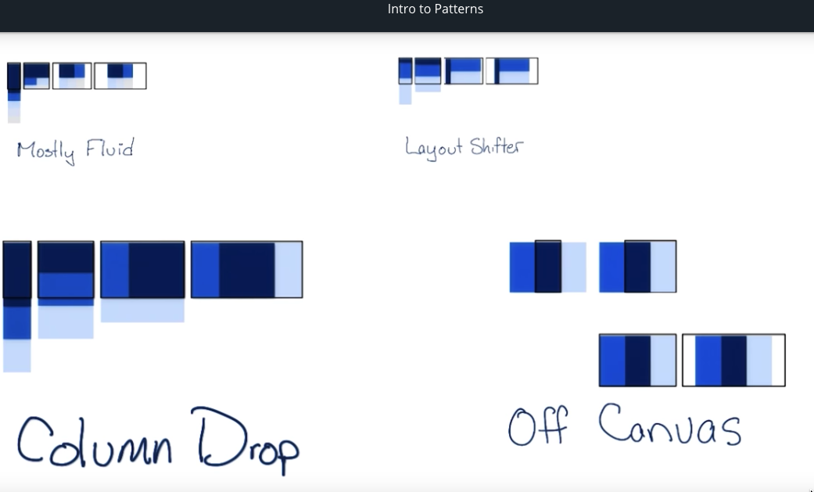

### Tables
- Hide no essential columns
    - `display:none;` removed from flow
    - `visibility: hidden;` space still in the flow
- No more Tables
    - `@media screen and (max-width: 500px) { table, thead, tbody, th, td, tr { display: block; } }`
    - add css formatting `position, padding`
    - `content: attr(data-th);`
- Contained Scrolling

### Fonts
- line length ~65 cpl
- use measures for breakpoints 
- `font-size:16px;`
- `line-height: 1.25em;`

### Minor breakpoints
- adjust margin
- change font-size

[Table of contents](#table-of-contents)
---
## Responsive Images
### Goal
- Highest quality images with fewest bytes possible!

### Units, Formats, Environments
- total bits= pixels x bits per pixels
- fixed size, width 100%, max-width: 100%

### Request and Revenue
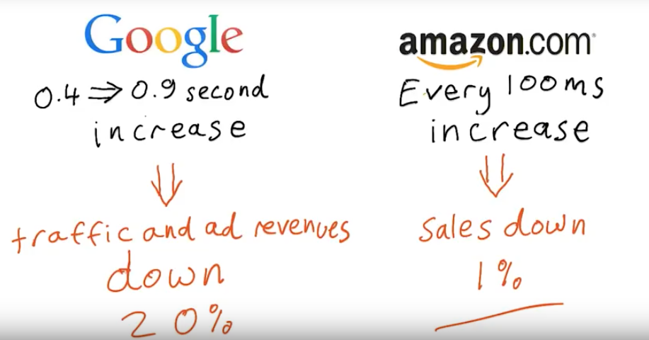

### Relative sizing
- use calc()
    - `img {
    margin-right: 10px;
    max-width: 426px;`
        - `width: calc((100% - 10px)/2);
    }`
    - `img:last-of-type {
    margin-right: 0;
    }`

### Landscape and Portrait
- landscape on desktop
- portrait on mobile and tablet
- screen rotation
- never assume screen width

### Viewport max min
- resize images according to viewport height / width
- `height: 100vh;`
- `width: 100vmax`
- `width: 100vmin;`

### Raster Vector
- Raster for pictures, points in canvas .png .jpg .webp
- Vector for logo anysize .svg

### File formats
- don't send pictures with higher natural resolution than display
    - except for high DPI devices
- use compression to reduce file size

### Tools
- Grunt
    - `sudo npm install -g grunt-cli`
    - in folder `npm install`
    - 2 files 
        - `package.json` used by npm
        - `Gruntfile.js` configure tasks and load Grunt plugins
    - [Gruntjs.com](https://gruntjs.com/getting-started)

- ImageMagick, ImageOptim

### Performance
- latency

- reduce images files
- reduce number of requests

### Text Problems
- use text over images rather the text in images
    - `div {font-size: 10vw; position: absolute; text-align: center; width : 100vw;}`
    - `img {position: absolute; width: 100%;}`
- Css effects on text ie border, box-shadow, animation, etc.
- careful css cost
    - [Fast Mobile Website](https://www.smashingmagazine.com/2013/04/build-fast-loading-mobile-website/)

### Css background images
- use elaborate background with only Css
- use conditional background image display
- use alternative images for different devices
    - full image vs crop/close up
- use `image-set()` or `srcset` in html see 'Respond to screen'
    - `div {
      background-image: url(icon1x.png);
      background-image: -webkit-image-set(url(icon1x.png) 1x, url(icon2x.png) 2x);
      background-image: image-set(url(icon1x.png) 1x, url(icon2x.png) 2x);
      height: 128px;
      width: 128px;
    }`
- `background-size: cover;` image as small as possible while filling its container
    - fit the smaller side of image overfill the other
- `background-size: contain;` image as large as possible while completely visible inside its container
    - fit the larger side of image repeat the other

### Symbol character
- use unicode character or glyphs instead of image
    - `<meta charset="utf-8">`
    - `&#160;` for no-break space

### Icon fonts
- vector file for resize, change color, add shadow, etc.
- use Zocial icon for social
- [Css tricks](https://css-tricks.com/examples/IconFont/)

### Inline images
- inline svg
- data uri
- in html or css to reduce http requests

### Image handling technique
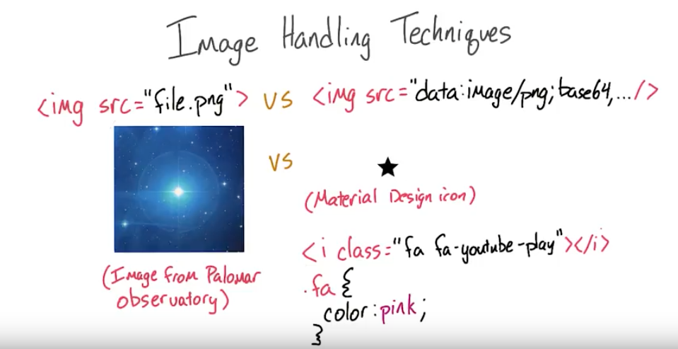
- inline less request Vs external with caching for reuse
- raster for photos Vs vector for icon & small animation

### Respond to screen 
- use `srcset` 
    - Width ``
    - DPR ``
- add size attribute in html for charging the right image at parse time but match with css
    - Html : ``
    - Css : `img {width: 50vw;} `
        - `@media screen and (max-width: 250px){ img {width: 100vw;}}`
- [device pixel density](http://pixensity.com/list/phone/)

### Picture Element
- `<picture>` requires `` as its last child. Without that, nothing is displayed. This is good for accessibility as there is just one traditional place for your alternate text, and it’s great for fallback content in old browsers, which just show the `` element.
- fallback alternative
    - `<picture>`
        - `<source srcset="kittens.webp" type="image/webp">`
        - `<source srcset="kittens.jpg" type="image/jpeg">`
        - ``
    - `</picture>`
- with media queries
    - `<picture>`
        - `<source
            media="(min-width: 1000px)"
            srcset="kookaburra_large_1x.jpg 1x, kookaburra_large_2x.jpg 2x">`
        - `<source
            media="(min-width: 500px)"
            srcset="kookaburra_medium_1x.jpg 1x, kookaburra_medium_2x.jpg 2x">`
        - ``
    - `</picture>`
- add polyfill [Picturefill](http://scottjehl.github.io/picturefill/) for compatibility
    - ``
- see [article](https://dev.opera.com/articles/responsive-images/)
    - Do I want my image sizes to change depending on my responsive design rules?
    - Do I want to optimize for high-dpi screens?
    - Do I want to serve images with different mime types to browsers that support them?
    - Do I want to serve different art depending on certain contextual factors?

### Accessibility
- `alt` attributes should 
    - be descriptive of important images
    - empty for images used as decoration
    - set on every images
- ``

[Table of contents](#table-of-contents)

---
## Accessibility
[WCAG](https://www.w3.org/TR/WCAG20/), [Checklist](https://webaim.org/standards/wcag/checklist)

- Perceivable
    - 1 Provide text alternatives for any non-text content so that it can be changed into other forms people need, such as large print, braille, speech, symbols or simpler language.
    - 2 Provide alternatives for time-based media.
    - 3 Create content that can be presented in different ways (for example simpler layout) without losing information or structure.
    - 4 Make it easier for users to see and hear content including separating foreground from background.
- Operable
    - 1 Make all functionality available from a keyboard.
    - 2 Provide users enough time to read and use content.
    - 3 Do not design content in a way that is known to cause seizures.
    - 4 Provide ways to help users navigate, find content, and determine where they are.
- Understandable
    - 1 Make text content readable and understandable.
    - 2 Make Web pages appear and operate in predictable ways.
    - 3 Help users avoid and correct mistakes.
- Robust
    - Maximize compatibility with current and future user agents, including assistive technologies.

### Focus
- `TAB` : forward, `Shift TAB` : backward, `Arrows` : navigate inside component
- Tab order for `input`, `button`, `select` implicitly focusable
- Not all elements focusable : headers, paragraphs, images no interactivity
- Ordered by the dom not the css 
    - WCAG 1.3.2 The reading and navigation order (determined by code order) is logical and intuitive.
- use `tabindex` to add focus to an element for interactivity
    - with '0' it enters the order flow
        - `
 Focus me! 
`
    - with '-1' make it accessible via javascript (with `focus()`method) but no part of the order flow
        - `
 Focus me! 
`
        - `document.querySelector('#modal').focus()`
- use Skip Links to go directly to main content
    - in html
        - `<body><a href="#maincontent" class="skip-link">Skip to main content</a> ...`
        - `<main id="maincontent" tabindex="-1"> <h1>Heading</h1>`
    - in css
        - `.skip-link {position: absolute; top:-100px; z-index:100;}`
        - `.skip-link:focus {top:0;}`
    - [link to techniques](https://webaim.org/techniques/skipnav/)
- use ARIA for complex components
    - [WAI-ARIA](https://www.w3.org/TR/wai-aria-practices-1.1/)

### Semantics Basics
- assistive Technology
    - screen reader, braille display, magnification, eye tracking, sip and puff, switch access, voice control
    - need to be programmaticaly implemented
- Affordances
    - buttons, scroll bars
    - graphic design gives clue to meaning
- Semantics
    - use semantics to give an interface for users of assistive technology
    - Role, Name/Label, State, Value
- Accessibility tree
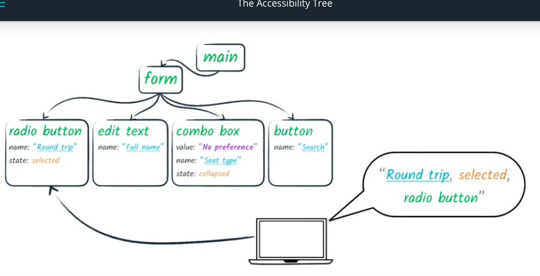
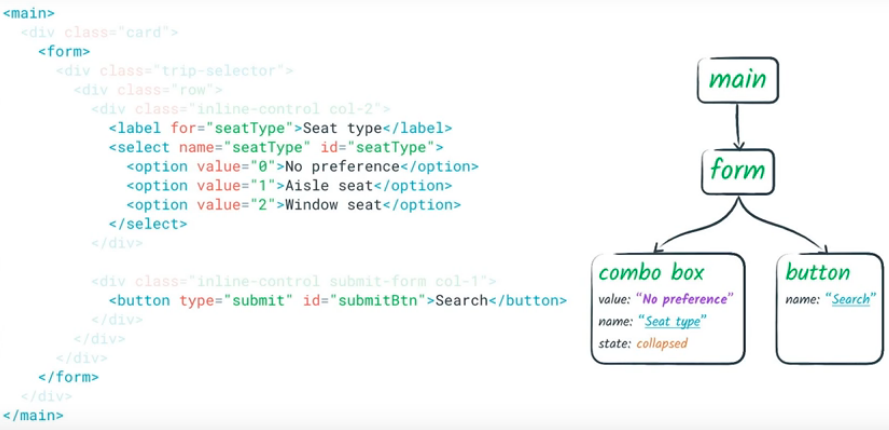
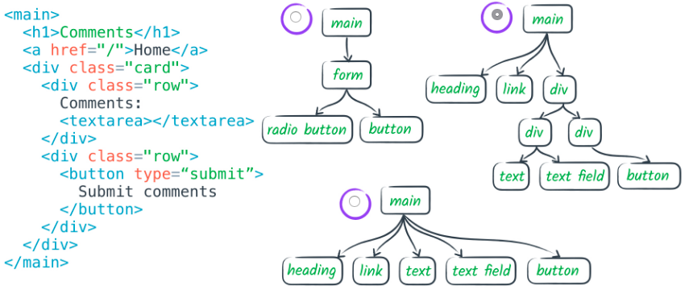
- Semantics in native HTML 
    - implicit if use correct tags
- non-text content [wcag1.1.1](https://webaim.org/standards/wcag/checklist#g1.1)
    - All images, form image buttons, and image map hot spots have appropriate, equivalent alternative text.
    - Images that do not convey content, are decorative, or contain content that is already conveyed in text are given null alt text (alt="") or implemented as CSS backgrounds. All linked images have descriptive alternative text.
    - Equivalent alternatives to complex images are provided in context or on a separate (linked and/or referenced via longdesc) page.
    - Form buttons have a descriptive value.
    - Form inputs have associated text labels.
    - Embedded multimedia is identified via accessible text.
    - Frames are appropriately titled.
- A `<label>` can be associated with a control either by placing the control element inside the `<label>` element, or by using the for attribute. 
    - `<label>Click me <input type="text"></label>`
    - 'for' attribute
        - `<label for="username">Click me</label>`
        - `<input type="text" id="username">`
- **Verify with Chrome devtools audit accessibility**
- provide explicit `alt` text for images
    - *if all images are 'broken' can we still understand the page content?*
- use empty `alt` for images that are redundant like in search button

### Navigation Content
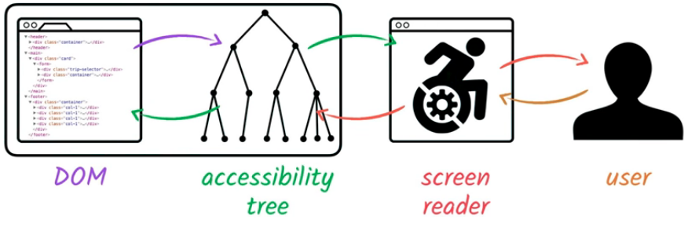
- Navigation by headings
    - Beyond providing an overall document structure, individual sections of content are designated using headings, where appropriate.
    - js snippet to use in console
        - `for (var i = 0, headings = $$('h1,h2,h3,h4,h5,h6');
            i < headings.length; i++) {
                console.log(headings[i].tagName + " " +  
                headings[i].textContent.trim(),
                headings[i]);
            }`
    - WebAIM checklist items:
        - [1.3.2](http://webaim.org/standards/wcag/checklist#sc1.3.2)
        , [2.4.10](http://webaim.org/standards/wcag/checklist#sc2.4.10)
        , [1.3.1](http://webaim.org/standards/wcag/checklist#sc1.3.1)
        , [2.4.1](http://webaim.org/standards/wcag/checklist#sc2.4.1)
        , [2.4.6](http://webaim.org/standards/wcag/checklist#sc2.4.6)
- Navigation by links, Form controls
    - `accesskey` Attribute
        - `<input type="text" id="name" accesskey="n">`
- link Text
    - [2.4.9](http://webaim.org/standards/wcag/checklist#sc2.4.9)
    - link anti-patterns
        - avoid false link like in span & onclick
    - use anchor tag with href
        - `<a href="#internal" > I'm a link </a>`
    - use button
        - `<button class='link' onclick="doSomething()"> Do something! </button>`
    - use alt text in img even when in a link
        - `<a href="/">`
        - `</img>`
        - `</a>`
    - no 'learn more' but 'learn about ${subject}'
- Landmarks
    - `<header> <nav> <main> <section> <article> <aside> <footer>`
     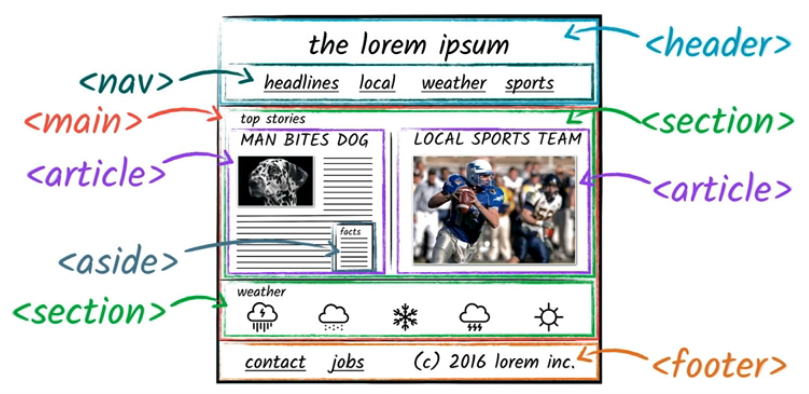
     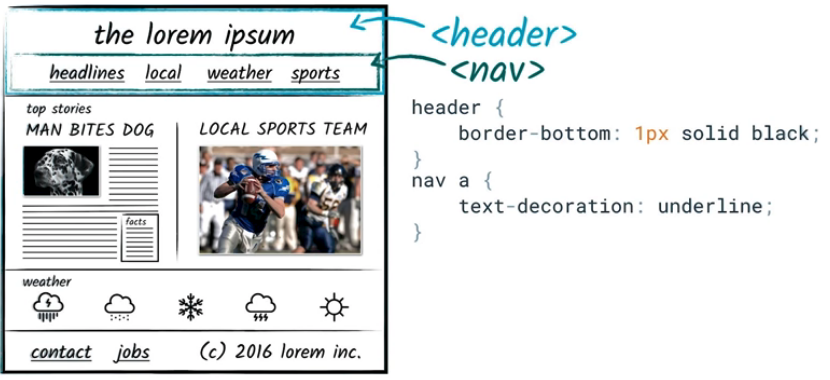

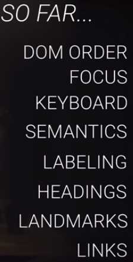

### ARIA
[*Accessible Rich Internet Application*](https://www.w3.org/TR/wai-aria/)
- No ARIA is better than Bad ARIA
    - Functionally, **ARIA roles, states, and properties** are analogous to a CSS for assistive technologies. For screen reader users, ARIA controls the rendering of their non-visual experience. Incorrect ARIA misrepresents visual experiences, with potentially devastating effects on their corresponding non-visual experiences.
- Why aria?
    - add non-native elements to the accessibility tree
        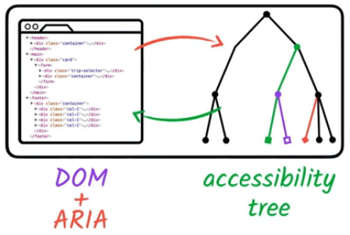
    - modify accessibility tree but need to code the right behavior, focus, and keyboard event
    - Figure illustrates the relationship between user agents (e.g., browsers), accessibility APIs, and assistive technologies. It describes the "contract" provided by the user agent to assistive technologies, which includes typical accessibility information found in the accessibility API for many of our accessible platforms for GUIs (role, state, selection, event notification, relationship information, and descriptions). The DOM, usually HTML, acts as the data model and view in a typical model-view-controller relationship, and JavaScript acts as the controller by manipulating the style and content of the displayed data. The user agent conveys relevant information to the operating system's accessibility API, which can be used by any assistive technologies, such as screen readers.
        - 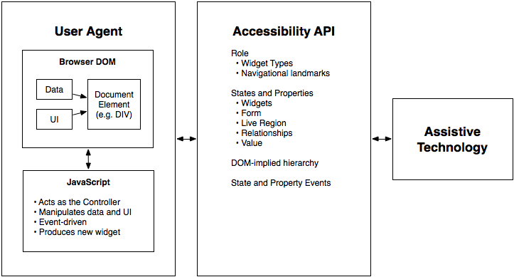
- [Roleplaying](https://www.w3.org/TR/wai-aria-practices-1.1/)
    - add Role to dom elements
        - Role: Main indicator of type. This semantic association allows tools to present and support interaction with the object in a manner that is consistent with user expectations about other objects of that type.
        - button, cell, checkbox, columnheader, gridcell, heading, link, menuitem, menuitemcheckbox, menuitemradio, option, radio, row, rowgroup, rowheader, switch, tab, tooltip, tree, treeitem

### Style

[Table of contents](#table-of-contents)

---
## Offline First
### Benefits
- The *Problem*
- What slow down
- Techniques
    - Deliver the page's header (and the content) from a cache on the device, the attempt to fetch updated content from the network.
### Service Worker
### IndexedDB & Caching

[Table of contents](#table-of-contents)

---
## ES 6
### Syntax
### Functions
### Built-ins
### Pro Dev-fu

[Table of contents](#table-of-contents)

