# Mobile Web Development - *by Google* 
see [Udacity MWS-nd](https://www.udacity.com/course/mobile-web-specialist-nanodegree--nd024) & [Google Web fundamentals](https://developers.google.com/web/fundamentals/)

### Table of Contents
Mobile Web Specialist
1. [Responsive Web Design](#responsive-web-design)
2. [Responsive Images](#responsive-images)
3. [Accessibility](#accessibility)
4. [Offline First](#offline-first)
    - [Project Restaurant Stage 1 ](#project-restaurant-stage-1)
5. [Asynchronous​ ​JavaScript​ ​Requests](#asynchronous​-javaScript​-requests)
6. [ES 6](#es-6)
7. [Web Tooling and automation](#web-tooling-and-automation)
8. 
9. 
10. 
11. 
12. [Tips and tricks](#tips-and-tricks)

Front End Web
1. [HTML CSS](#html-css)
2. [Responsive Web Design](#responsive-web-design) - mws
3. [Responsive Images](#responsive-images) - mws
4. [Javascript Basics](#javascript-basics) ...
5. [Intro to jquery](#intro-to-jquery) ...
6. [Object-Oriented JS](#object-oriented-js) ...
7. [Html5 Canvas](#html5-canvas) ...
8. [Website Performance Optimization](#website-performance-optimization) ...
9. [Browser Rendering Optimization](#browser-rendering-optimization) ...
10. [Intro to Ajax](#intro-to-ajax) ...
11. [JS Design Patterns](#js-design-patterns)
12. [JS Testing](#js-testing) ...
13. [How to use Git](#how-to-use-git) ...

[Table of contents](#table-of-contents)

---
## Responsive Web Design
*Responsive web design responds to the needs of the users and the devices they're using. The layout changes based on the size and capabilities of the device. For example, on a phone users would see content shown in a single column view; a tablet might show the same content in two columns.*
### Pixels
- Screen Resolution / Hardware Pixel
- CSS pixel - Viewport
    - CSS=SR/DPR
- DPR - Device pixel ratio
    - DPR=SR/CSS

### Set Viewport
- `<meta name="viewport" content="width=device-width, initial-scale=1">`

### Relative width
- in Css
- `img, embed, object, video { max-width: 100%; }`

### Tap Target
- button should be 48px by 48px with 40px space
- in Css `min-width: 48px; min-height: 48px;`
- add `padding: 1.5em`

### Start Small
- prioritize content and add from Phone -> Tablet -> Laptop -> Desktop
- performance: how much Data for Phone

### Breakpoints
- choose breakpoints for different screen size
- `@media screen and (min-width: 601px) and (max-width: 992px){...}`

### Flexbox
- use `div class="container"` in html
- use `.container {display: flex;}` in css
- use `order:1 ; width:100%;` in css

### Patterns
- use responsive patterns
- fluid, etc
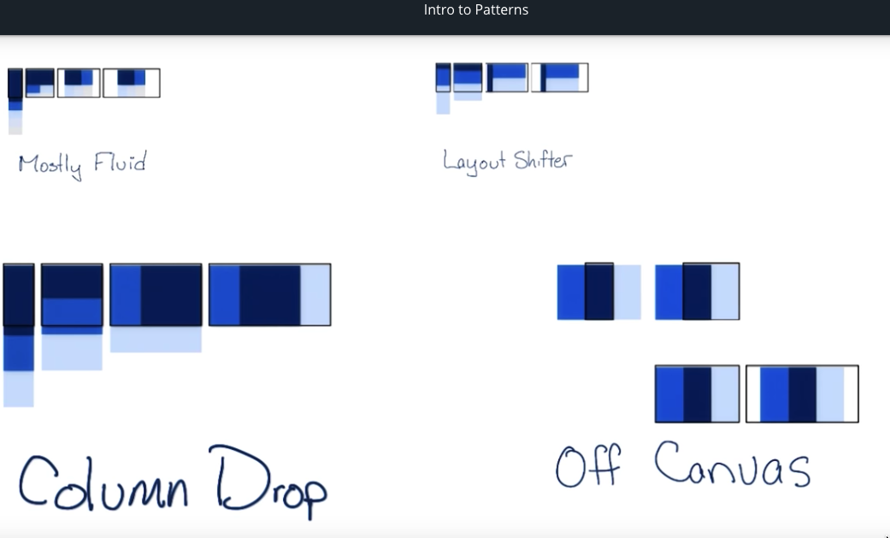

### Tables
- Hide no essential columns
    - `display:none;` removed from flow
    - `visibility: hidden;` space still in the flow
- No more Tables
    - `@media screen and (max-width: 500px) { table, thead, tbody, th, td, tr { display: block; } }`
    - add css formatting `position, padding`
    - `content: attr(data-th);`
- Contained Scrolling

### Fonts
- line length ~65 cpl
- use measures for breakpoints 
- `font-size:16px;`
- `line-height: 1.25em;`

### Minor breakpoints
- adjust margin
- change font-size

[Table of contents](#table-of-contents)

---
## Responsive Images
### Goal
- Highest quality images with fewest bytes possible!

### Units, Formats, Environments
- total bits= pixels x bits per pixels
- fixed size, width 100%, max-width: 100%

### Request and Revenue
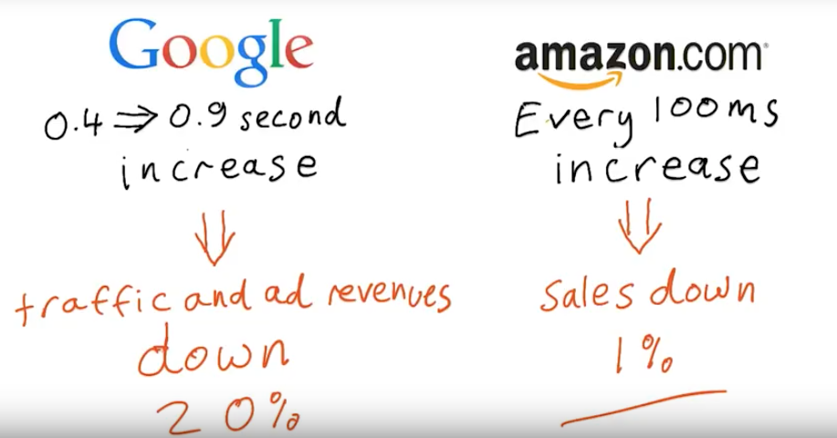

### Relative sizing
- use calc()

        img {
            margin-right: 10px;
            max-width: 426px;
            width: calc((100% - 10px)/2);
        }
        img:last-of-type {
            margin-right: 0;
        }

### Landscape and Portrait
- landscape on desktop
- portrait on mobile and tablet
- screen rotation
- never assume screen width

### Viewport max min
- resize images according to viewport height / width
- `height: 100vh;`
- `width: 100vmax;`
- `width: 100vmin;`

### Raster Vector
- Raster for pictures, points in canvas .png .jpg .webp
- Vector for logo anysize .svg

### File formats
- don't send pictures with higher natural resolution than display
    - except for high DPI devices
- use compression to reduce file size

### Tools
- Grunt
    - `sudo npm install -g grunt-cli`
    - in folder `npm install`
    - 2 files 
        - `package.json` used by npm
        - `Gruntfile.js` configure tasks and load Grunt plugins
    - [Gruntjs.com](https://gruntjs.com/getting-started)

- ImageMagick, ImageOptim

### Performance
- latency

- reduce images files
- reduce number of requests

### Text Problems
- use text over images rather the text in images
    - `div {font-size: 10vw; position: absolute; text-align: center; width : 100vw;}`
    - `img {position: absolute; width: 100%;}`
- Css effects on text ie border, box-shadow, animation, etc.
- careful css cost
    - [Fast Mobile Website](https://www.smashingmagazine.com/2013/04/build-fast-loading-mobile-website/)

### Css background images
- use elaborate background with only Css
- use conditional background image display
- use alternative images for different devices
    - full image vs crop/close up
- use `image-set()` or `srcset` in html see 'Respond to screen'
    
        div {
            background-image: url(icon1x.png);
            background-image: -webkit-image-set(url(icon1x.png) 1x, url(icon2x.png) 2x);
            background-image: image-set(url(icon1x.png) 1x, url(icon2x.png) 2x);
            height: 128px;
            width: 128px;
        }

- `background-size: cover;` image as small as possible while filling its container
    - fit the smaller side of image overfill the other
- `background-size: contain;` image as large as possible while completely visible inside its container
    - fit the larger side of image repeat the other

### Symbol character
- use unicode character or glyphs instead of image
    - `<meta charset="utf-8">`
    - `&#160;` for no-break space

### Icon fonts
- vector file for resize, change color, add shadow, etc.
- use Zocial icon for social
- [Css tricks](https://css-tricks.com/examples/IconFont/)

### Inline images
- inline svg
- data uri
- in html or css to reduce http requests

### Image handling technique
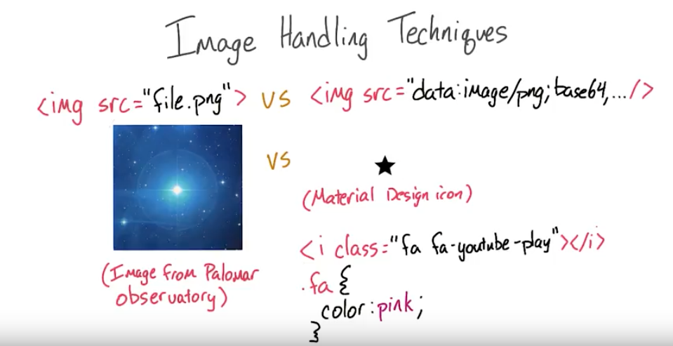
- inline less request Vs external with caching for reuse
- raster for photos Vs vector for icon & small animation

### Respond to screen 
- use `srcset` 
    - Width ``
    - DPR ``
- add size attribute in html for charging the right image at parse time but match with css
    - Html : ``
    - Css : `img {width: 50vw;} `
        - `@media screen and (max-width: 250px){ img {width: 100vw;}}`
- [device pixel density](http://pixensity.com/list/phone/)

### Picture Element
- `<picture>` requires `` as its last child. Without that, nothing is displayed. This is good for accessibility as there is just one traditional place for your alternate text, and it’s great for fallback content in old browsers, which just show the `` element.
- fallback alternative
    
        <picture>
            <source srcset="kittens.webp" type="image/webp">
            <source srcset="kittens.jpg" type="image/jpeg">
            
        </picture>

- with media queries
    
        <picture>
            <source
                media="(min-width: 1000px)"
                srcset="kookaburra_large_1x.jpg 1x, kookaburra_large_2x.jpg 2x">
            <source
                media="(min-width: 500px)"
                srcset="kookaburra_medium_1x.jpg 1x, kookaburra_medium_2x.jpg 2x">`
            
        </picture>

- add polyfill [Picturefill](http://scottjehl.github.io/picturefill/) for compatibility
    - ``
- see [article](https://dev.opera.com/articles/responsive-images/)
    - Do I want my image sizes to change depending on my responsive design rules?
    - Do I want to optimize for high-dpi screens?
    - Do I want to serve images with different mime types to browsers that support them?
    - Do I want to serve different art depending on certain contextual factors?

### Accessibility
- `alt` attributes should 
    - be descriptive of important images
    - empty for images used as decoration
    - set on every images
- ``

[Table of contents](#table-of-contents)

---
## Accessibility
[WCAG](https://www.w3.org/TR/WCAG20/), [Checklist](https://webaim.org/standards/wcag/checklist)

- Perceivable
    - 1 Provide text alternatives for any non-text content so that it can be changed into other forms people need, such as large print, braille, speech, symbols or simpler language.
    - 2 Provide alternatives for time-based media.
    - 3 Create content that can be presented in different ways (for example simpler layout) without losing information or structure.
    - 4 Make it easier for users to see and hear content including separating foreground from background.
- Operable
    - 1 Make all functionality available from a keyboard.
    - 2 Provide users enough time to read and use content.
    - 3 Do not design content in a way that is known to cause seizures.
    - 4 Provide ways to help users navigate, find content, and determine where they are.
- Understandable
    - 1 Make text content readable and understandable.
    - 2 Make Web pages appear and operate in predictable ways.
    - 3 Help users avoid and correct mistakes.
- Robust
    - Maximize compatibility with current and future user agents, including assistive technologies.

### Focus
- `TAB` : forward, `Shift TAB` : backward, `Arrows` : navigate inside component
- Tab order for `input`, `button`, `select` implicitly focusable
- Not all elements focusable : headers, paragraphs, images no interactivity
- Ordered by the dom not the css 
    - WCAG 1.3.2 The reading and navigation order (determined by code order) is logical and intuitive.
- use `tabindex` to add focus to an element for interactivity
    - with '0' it enters the order flow
        - `
 Focus me! 
`
    - with '-1' make it accessible via javascript (with `focus()`method) but no part of the order flow
        - `
 Focus me! 
`
        - `document.querySelector('#modal').focus()`
- use Skip Links to go directly to main content
    - in html
        - `<body><a href="#maincontent" class="skip-link">Skip to main content</a> ...`
        - `<main id="maincontent" tabindex="-1"> <h1>Heading</h1>`
    - in css
        - `.skip-link {position: absolute; top:-100px; z-index:100;}`
        - `.skip-link:focus {top:0;}`
    - [link to techniques](https://webaim.org/techniques/skipnav/)
- use ARIA for complex components
    - [WAI-ARIA](https://www.w3.org/TR/wai-aria-practices-1.1/)

### Semantics Basics
- assistive Technology
    - screen reader, braille display, magnification, eye tracking, sip and puff, switch access, voice control
    - need to be programmaticaly implemented
- Affordances
    - buttons, scroll bars
    - graphic design gives clue to meaning
- Semantics
    - use semantics to give an interface for users of assistive technology
    - Role, Name/Label, State, Value
- Accessibility tree
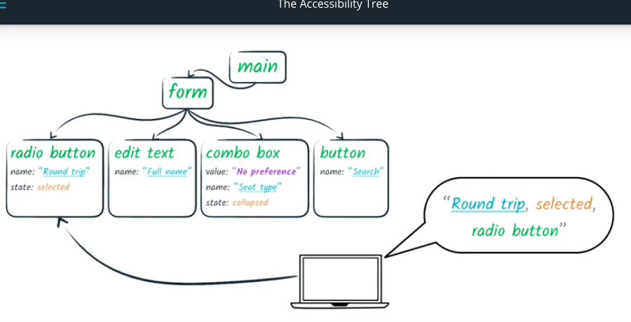
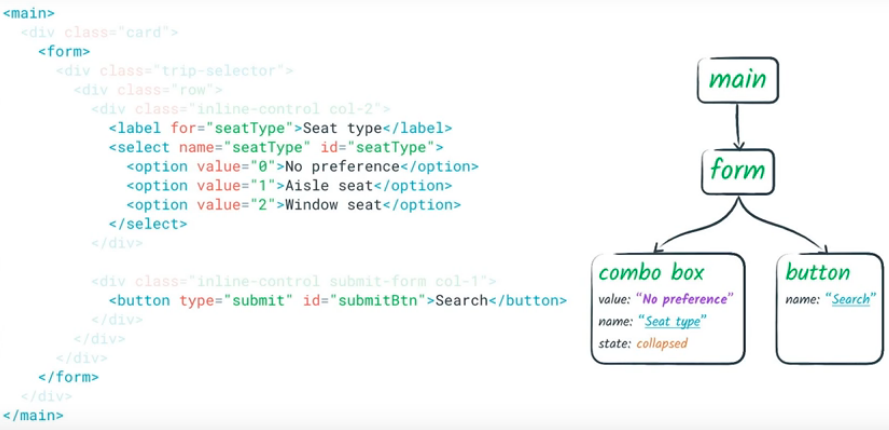
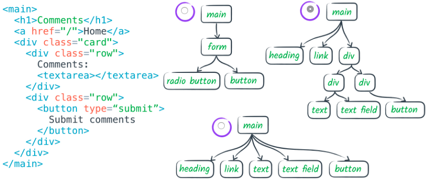
- Semantics in native HTML 
    - implicit if use correct tags
- non-text content [wcag1.1.1](https://webaim.org/standards/wcag/checklist#g1.1)
    - All images, form image buttons, and image map hot spots have appropriate, equivalent alternative text.
    - Images that do not convey content, are decorative, or contain content that is already conveyed in text are given null alt text (alt="") or implemented as CSS backgrounds. All linked images have descriptive alternative text.
    - Equivalent alternatives to complex images are provided in context or on a separate (linked and/or referenced via longdesc) page.
    - Form buttons have a descriptive value.
    - Form inputs have associated text labels.
    - Embedded multimedia is identified via accessible text.
    - Frames are appropriately titled.
- A `<label>` can be associated with a control either by placing the control element inside the `<label>` element, or by using the for attribute. 
    - `<label>Click me <input type="text"></label>`
    - 'for' attribute
        
            <label for="username">Click me</label>
            <input type="text" id="username">

- **Verify with Chrome devtools audit accessibility**
- provide explicit `alt` text for images
    - *if all images are 'broken' can we still understand the page content?*
- use empty `alt` for images that are redundant like in search button

### Navigation Content
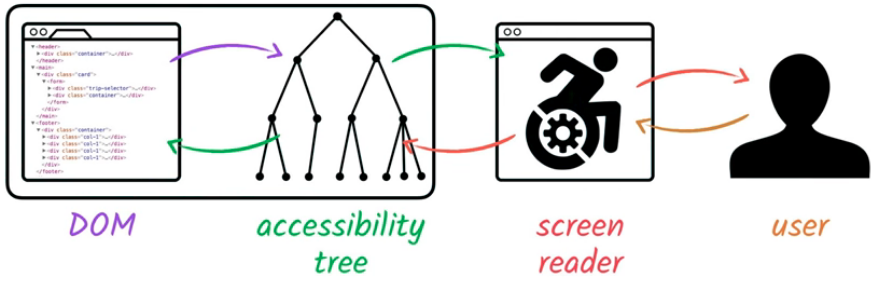
- Navigation by headings
    - Beyond providing an overall document structure, individual sections of content are designated using headings, where appropriate.
    - js snippet to use in console
        - `for (var i = 0, headings = $$('h1,h2,h3,h4,h5,h6');
            i < headings.length; i++) {
                console.log(headings[i].tagName + " " +  
                headings[i].textContent.trim(),
                headings[i]);
            }`
    - WebAIM checklist items:
        - [1.3.2](http://webaim.org/standards/wcag/checklist#sc1.3.2)
        , [2.4.10](http://webaim.org/standards/wcag/checklist#sc2.4.10)
        , [1.3.1](http://webaim.org/standards/wcag/checklist#sc1.3.1)
        , [2.4.1](http://webaim.org/standards/wcag/checklist#sc2.4.1)
        , [2.4.6](http://webaim.org/standards/wcag/checklist#sc2.4.6)
- Navigation by links, Form controls
    - `accesskey` Attribute
        - `<input type="text" id="name" accesskey="n">`
- link Text
    - [2.4.9](http://webaim.org/standards/wcag/checklist#sc2.4.9)
    - link anti-patterns
        - avoid false link like in span & onclick
    - use anchor tag with href
        - `<a href="#internal" > I'm a link </a>`
    - use button
        - `<button class='link' onclick="doSomething()"> Do something! </button>`
    - use alt text in img even when in a link
        
            <a href="/">
            </img>
            </a>

    - no 'learn more' but 'learn about ${subject}'
- Landmarks
    - `<header> <nav> <main> <section> <article> <aside> <footer>`
     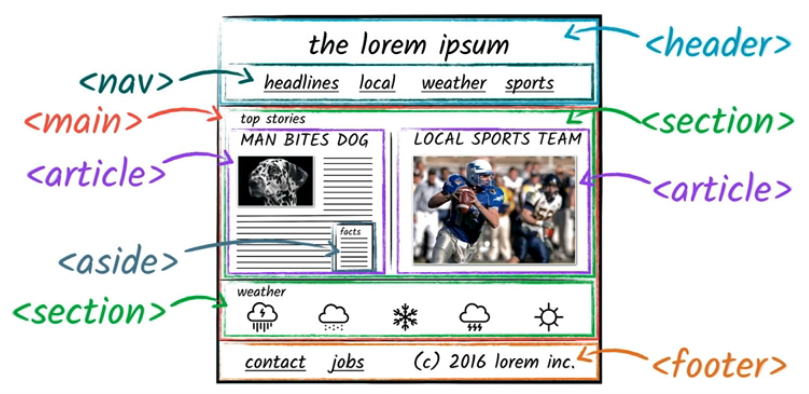
     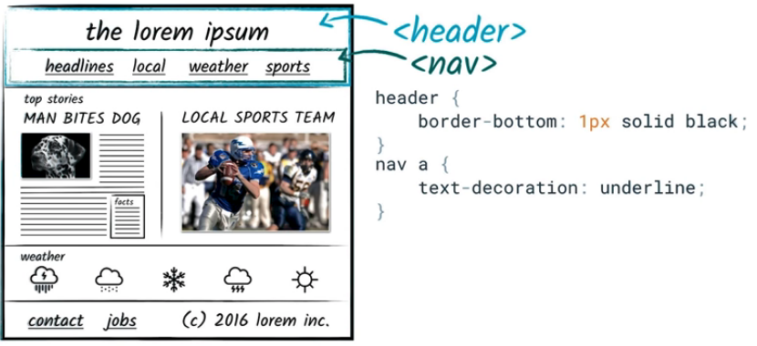

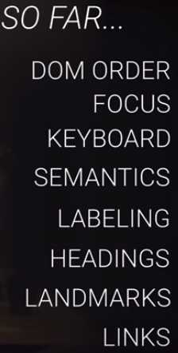

### ARIA
[*Accessible Rich Internet Application*](https://www.w3.org/TR/wai-aria/)
- No ARIA is better than Bad ARIA
    - Functionally, **ARIA roles, states, and properties** are analogous to a CSS for assistive technologies. For screen reader users, ARIA controls the rendering of their non-visual experience. Incorrect ARIA misrepresents visual experiences, with potentially devastating effects on their corresponding non-visual experiences.
- Why aria?
    - add non-native elements to the accessibility tree
        - 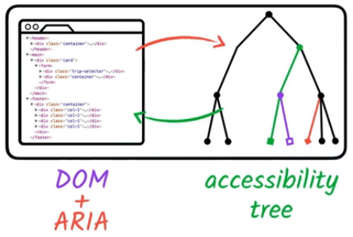
    - modify accessibility tree but need to code the right behavior, focus, and keyboard event
    - Figure illustrates the relationship between user agents (e.g., browsers), accessibility APIs, and assistive technologies. It describes the "contract" provided by the user agent to assistive technologies, which includes typical accessibility information found in the accessibility API for many of our accessible platforms for GUIs (role, state, selection, event notification, relationship information, and descriptions). The DOM, usually HTML, acts as the data model and view in a typical model-view-controller relationship, and JavaScript acts as the controller by manipulating the style and content of the displayed data. The user agent conveys relevant information to the operating system's accessibility API, which can be used by any assistive technologies, such as screen readers.
        - 
- [Roleplaying](https://www.w3.org/TR/wai-aria-practices-1.1/)
    - add Role to dom elements
        - Role: Main indicator of type. This semantic association allows tools to present and support interaction with the object in a manner that is consistent with user expectations about other objects of that type.
        - button, cell, checkbox, columnheader, gridcell, heading, link, menuitem, menuitemcheckbox, menuitemradio, option, radio, row, rowgroup, rowheader, switch, tab, tooltip, tree, treeitem

(...)

### Style
- Focus styles
- Input Modality
- Styling with Aria
- Responsive Design for multi-device
- Mobile Screen Reader
- Color & Contrast

(...)

[Table of contents](#table-of-contents)

---
## Offline First
### Benefits
- The *Problem*
    - Lie-Fi the connection limbo... wait wait wait
    -  
- What slow down
    - 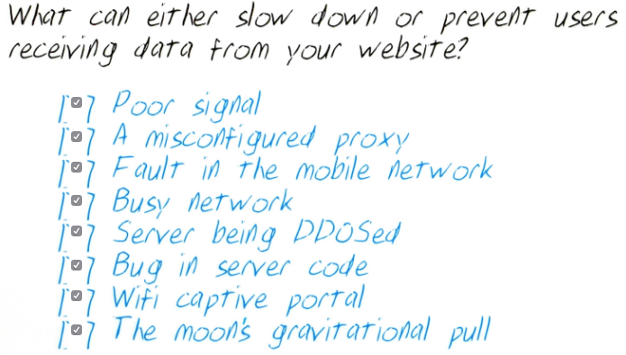
- Techniques
    - Deliver the page's header (and the content) from a cache on the device, then attempt to fetch updated content from the network.

### Service Worker
[Fundamentals](https://developers.google.com/web/fundamentals/primers/service-workers/)
- Register
    - in `main.js` or `html` script tag
    - ⚠️ - scope of the service worker is the directory where `sw.js` is placed
            
        One subtlety with the `register()` method is the location of the service worker file. You'll notice in this case that the service worker file is at the root of the domain. This means that the service worker's scope will be the entire origin. In other words, this service worker will receive fetch events for everything on this domain. If we register the service worker file at `/example/sw.js`, then the service worker would only see fetch events for pages whose URL starts with `/example/`

            if ('serviceWorker' in navigator) {
            window.addEventListener('load', function() {
                navigator.serviceWorker.register('/sw.js').then(function(registration) {
                // Registration was successful
                console.log('ServiceWorker registration successful with scope: ', registration.scope);
                }, function(err) {
                // registration failed :(
                console.log('ServiceWorker registration failed: ', err);
                });
            });
            }

- Caching

        var CACHE_NAME = 'my-site-cache-v1';
        var urlsToCache = [
            '/',
            '/styles/main.css',
            '/script/main.js'
            ];
        self.addEventListener('install', function(event) {
        // Perform install steps
        event.waitUntil(
            caches.open(CACHE_NAME)
            .then(function(cache) {
                console.log('Opened cache');
                return cache.addAll(urlsToCache);
            })
        );
        });

- Fetching
    - What we are doing is this:
    1. Add a callback to .then() on the fetch request.
    2. Once we get a response, we perform the following checks:
        - Ensure the response is valid.
        - Check the status is 200 on the response.
        - Make sure the response type is basic, which indicates that it's a request from our origin. This means that requests to third party assets aren't cached as well.
    3. If we pass the checks, we clone the response. The reason for this is that because the response is a Stream, the body can only be consumed once. Since we want to return the response for the browser to use, as well as pass it to the cache to use, we need to clone it so we can send one to the browser and one to the cache.

            self.addEventListener('fetch', function(event) {
                event.respondWith(
                caches.match(event.request)
                    .then(function(response) {
                    // Cache hit - return response
                    if (response) {
                        return response;
                    }
            
                    // IMPORTANT: Clone the request. A request is a stream and
                    // can only be consumed once. Since we are consuming this
                    // once by cache and once by the browser for fetch, we need
                    // to clone the response.
                    var fetchRequest = event.request.clone();
            
                    return fetch(fetchRequest).then(
                        function(response) {
                        // Check if we received a valid response
                        if(!response || response.status !== 200 || response.type !== 'basic') {
                            return response;
                        }
            
                        // IMPORTANT: Clone the response. A response is a stream
                        // and because we want the browser to consume the response
                        // as well as the cache consuming the response, we need
                        // to clone it so we have two streams.
                        var responseToCache = response.clone();
            
                        caches.open(CACHE_NAME)
                            .then(function(cache) {
                            cache.put(event.request, responseToCache);
                            console.log('cache updated')
                            });
            
                        return response;
                        }
                    );
                    })
                );
            });

(...)

[Table of contents](#table-of-contents)

---
### Project Restaurant Stage 1
#### Steps to complete the project
- Fork and clone the starter repository. The code in this repository will serve as your baseline to begin development.
You'll need your own Google Maps API key. Replace the text YOUR_GOOGLE_MAPS_API_KEY on line 37 of index.html with your own key.
- Convert the provided site to use a responsive design .
- Bootstrap and other CSS frameworks should not be used; all responsiveness should be done with CSS.
- Use appropriate document type declaration and viewport tags
- Create a responsive grid-based layout using CSS
- Use media queries that provide fluid breakpoints across different screen sizes
- Use responsive images that adjust for the dimensions and resolution of any mobile device
- Implement accessibility features in the site HTML (most of this HTML is generated by JavaScript functions).
- Add a ServiceWorker script to cache requests to all of the site’s assets so that any page that has been visited by a user will be accessible when the user is offline. Only caching needs to be implemented, no other ServiceWorker features.

#### Before Submitting
- Make sure your code adheres to our HTML, CSS, JavaScript, and Git style guidelines.
    - [Udacity's HTML Style Guide](http://udacity.github.io/frontend-nanodegree-styleguide/index.html)
    - [Udacity's CSS Style Guide](http://udacity.github.io/frontend-nanodegree-styleguide/css.html)
    - [Udacity's JavaScript Style Guide](http://udacity.github.io/frontend-nanodegree-styleguide/javascript.html)
    - [Udacity's Git Style Guide](https://udacity.github.io/git-styleguide/)
- We recommend using Git from the very beginning. Make sure to commit often and to use well-formatted commit messages that conform to our guidelines.

#### Rubric
- **Responsive Design**

    | CRITERIA | MEETS SPECIFICATIONS |
    | --- | --- | 
    | Is the site UI compatible with a range of display sizes? | All content is responsive and displays on a range of display sizes. |
    || Content should make use of available screen real estate and should display correctly at all screen sizes. |
    || An image's associated title and text renders next to the image in all viewport sizes. |
    | Are images responsive? | Images in the site are sized appropriate to the viewport and do not crowd or overlap other elements in the browser, regardless of viewport size.
    | Are application elements visible and usable in all viewports? | On the main page, restaurants and images are displayed in all viewports. The detail page includes a map, hours and reviews in all viewports.

- **Accessibility**

    | CRITERIA | MEETS SPECIFICATIONS |
    | --- | --- |
    |Are images accessible? | All content-related images include appropriate alternate text that clearly describes the content of the image. |
    | Is focus used appropriately to allow easy navigation of the site? | Focus is appropriately managed allowing users to noticeably tab through each of the important elements of the page. Modal or interstitial windows appropriately lock focus.|
    | Are site elements defined semantically? | Elements on the page use the appropriate semantic elements. For those elements in which a semantic element is not available, appropriate ARIA roles are defined. |

- **Offline Availability**

    | CRITERIA | MEETS SPECIFICATIONS |
    | --- | --- |
    | Are pages that have been visited available offline? | When available in the browser, the site uses a service worker to cache responses to requests for site assets. Visited pages are rendered when there is no network access.

[Table of contents](#table-of-contents)

---
### IndexedDB & Caching

[Table of contents](#table-of-contents)

---
## Asynchronous​ ​JavaScript​ ​Requests
### AJAX 
Asynchronous JavaScript And XML. but with JSON also...
- AJAX is a developer's dream, because you can:
    - Read data from a web server - after the page has loaded
    - Update a web page without reloading the page
    - Send data to a web server - in the background

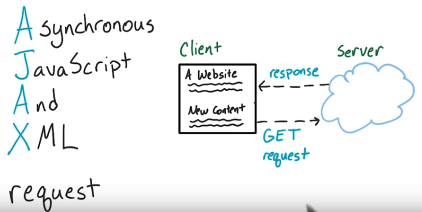
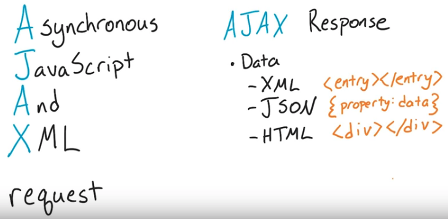
 
- API
    - The acronym "API" stands for:
        - Application
        - Programming
        - Interface
    - [Google's APIs](https://developers.google.com/apis-explorer/) All the Google services you can imagine.
    - [Giant database](http://www.programmableweb.com/apis/directory) of APIs This is definitely worth skimming for some inspiration.

### Ajax with XHR
- Docs
    - MDN's docs - https://developer.mozilla.org/en-US/docs/Web/API/XMLHttpRequest/open
    - WHATWG Spec - https://xhr.spec.whatwg.org/
    - W3C Spec - https://www.w3.org/TR/XMLHttpRequest/
- XHR Object    
    - `const asyncRequestObject = new XMLHttpRequest();`
- XHR Method
    - `.open()` takes a number of parameters, but the most important are its first two: the HTTP method URL to send the request
        - `asyncRequestObject.open();`
        - `asyncRequestObject.open('GET', 'https://unsplash.com');`
        - HTTP methods
            - GET - to retrieve data
            - POST - to send data
    - `.send()`
        - `asyncRequestObject.send();`
- XHR Full Request

        function handleSuccess () { 
        console.log( this.responseText ); 
        // the HTML of https://unsplash.com/
        }
        function handleError () { 
        console.log( 'An error occurred \uD83D\uDE1E' );
        }
        const asyncRequestObject = new XMLHttpRequest();
        asyncRequestObject.open('GET', 'https://unsplash.com');
        asyncRequestObject.onload = handleSuccess;
        asyncRequestObject.onerror = handleError;
        asyncRequestObject.send();

- for JSON

        function handleSuccess () {
        const data = JSON.parse( this.responseText ); // convert data from JSON to a JavaScript object
        console.log( data );
        }
        asyncRequestObject.onload = handleSuccess;

- for API unsplash

        const searchedForText = 'hippos';
        const unsplashRequest = new XMLHttpRequest();

        unsplashRequest.open('GET', `https://api.unsplash.com/search/photos?page=1&query=${searchedForText}`);
        unsplashRequest.onload = addImage;
        unsplashRequest.setRequestHeader('Authorization', 'Client-ID <your-client-id>');
        unsplashRequest.send();

        function addImage(){
        }

- XHR Usage Review
    - There are a number of steps you need to take to send an HTTP request asynchronously with JavaScript.
        - To Send An Async Request
            - create an XHR object with the XMLHttpRequest constructor function
            - use the `.open()` method - set the HTTP method and the URL of the resource to be fetched
            - set the `.onload` property - set this to a function that will run upon a successful fetch
            - set the `.onerror` property - set this to a function that will run when an error occurs
            - use the `.send()` method - send the request
        - To Use The Response
            - use the `.responseText` property - holds the text of the async request's response

### Ajax with JQuery

- `.ajax()` [method](http://api.jquery.com/jquery.ajax/)

        $.ajax(<url-to-fetch>, <a-configuration-object>);
        // or 
        $.ajax(<just a configuration object>);

        // example
        function handleResponse(data) {
            console.log('the ajax request has finished!');
            console.log(data);
        }
        $.ajax({
            url: 'https://swapi.co/api/people/1/'
        }).done(handleResponse);

    - with headers
        
            $.ajax({url:https://api.unsplash.com/search/photos?page=1&query=${searchedForText}, 
                headers: {
                    Authorization: 'Client-ID 123abc456def'
                    }
            }).done(addImage);
    - add images

            function addImage(images) {
            const firstImage = images.results[0];

            responseContainer.insertAdjacentHTML('afterbegin', `<figure>
                    
                    <figcaption>${searchedForText} by ${firstImage.user.name}</figcaption>
                </figure>`
            );
            }
        - the function now has one parameter `images`
        - this parameter has already been converted from JSON to a JavaScript object, so the line that had `JSON.parse()` is no longer needed.
        - the `firstImage` variable is set to the `images.results` first item
- Call Stack
    - the order is:
        1. our code in an anonymous function calls `.ajax()`
        2. `.ajax()` calls a `.send()` method
        3. `.send()` calls `options.xhr()`
        4. `options.xhr()` calls `jQuery.ajaxSettings.xhr` which creates a new XHR object
    - [CallStack in Devtools](MWeb_dev/ud109-l2-jquery-xhr-call-stack.gif) 
    - jQuery's ajax method does a lot of things under the hood.
        - creates a new XHR object each time it's called
        - sets all of the XHR properties and methods
        - sends the XHR request
- jQuery has a number of other methods that can be used to make asynchronous calls. These methods are:
`.get()
.getJSON()
.getScript()
.post()
.load()`
    - Each one of these functions in turn calls jQuery's main `.ajax()` method. These are called *"convenience methods"* because they provide a convenient interface and do some default configuration of the request before calling `.ajax()`.
    - It's often considered good practice to use the `$.ajax()` method over the jQuery provided convenience methods.

### Ajax with Fetch
- Promised-based 
    - see if [supported](http://caniuse.com/#feat=fetch)
    - might need a [polyfill](https://github.com/github/fetch)
- Fetch Request
    - `fetch('<URL-to-the-resource-that-is-being-requested>');`
    - return a Promise
    - with headers

            fetch(https://api.unsplash.com/search/photos?page=1&query=${searchedForText}, { 
                headers: { 
                    Authorization: 'Client-ID abc123' 
                } 
            });
        - or with new Headers [constructor function](https://developer.mozilla.org/en-US/docs/Web/API/Headers).
                        
                const requestHeaders = new Headers(); 
                requestHeaders.append('Authorization', 'Client-ID abc123'); 
                fetch(https://api.unsplash.com/search/photos?page=1&query=${searchedForText}, { 
                    headers: requestHeaders 
                });
    - the default HTTP method for a Fetch request is the `GET` method. We can choose a different HTTP method by passing a method property in the configuration object:

            fetch(`https://api.unsplash.com/search/photos?page=1&query=${searchedForText}`, {
                method: 'POST'
            });

    - [Fetch](https://fetch.spec.whatwg.org/)

- Fetch Response
    - Since a Fetch request returns a Promise, then all you have to do is call `.then()` on that Promise.

            fetch(`https://api.unsplash.com/search/photos?page=1&query=${searchedForText}`, {
                headers: {
                    Authorization: 'Client-ID abc123'
                }
            }).then(response => response.json())
            .then(addImage)
            .catch(e => requestError(e, 'image'));
        
            function addImage(data) {
                let htmlContent = '';
                const firstImage = data.results[0];
            
                if (firstImage) {
                    htmlContent = `<figure>
                        
                        <figcaption>${searchedForText} by ${firstImage.user.name}</figcaption>
                    </figure>`;
                } else {
                    htmlContent = 'Unfortunately, no image was returned for your search.'
                }
            
                responseContainer.insertAdjacentHTML('afterbegin', htmlContent);
            }
            function requestError(e, part) {
                console.log(e);
                responseContainer.insertAdjacentHTML('beforeend', `
Oh no! There was an error making a request for the ${part}.
`);
            }

[Table of contents](#table-of-contents)

---
## ES 6
### Syntax
### Functions
### Built-ins
### Pro Dev-fu

[Table of contents](#table-of-contents)

---
## Web Tooling and automation
### WTA Introduction
### Productive Editing
### Powerfull Builds
### Expressive Live Editing
### How to Prevent Disaster
### Awesome Optimizations
### WTA Conclusion

[Table of contents](#table-of-contents)

---
## Tips and Tricks
### Devtools
Debugging in Chrome
- TIP: debugging is a JavaScript application that can seem like a complicated process, check out the following resources on Google's Developer site:

    - [Pause Your Code With Breakpoints](https://developers.google.com/web/tools/chrome-devtools/javascript/breakpoints)
    - [JavaScript Debugging Reference](https://developers.google.com/web/tools/chrome-devtools/javascript/reference)

### Html
- [Html Reference - MDN](https://developer.mozilla.org/en-US/docs/Web/HTML/Reference)

### Css
- [Css Reference - MDN](https://developer.mozilla.org/en-US/docs/Web/CSS/Reference)
- position
    - fixed
    - static
    - sticky

            header {
                position: sticky;
                top: 0;
                z-index: 1000;
            }

### Javascript
[Table of contents](#table-of-contents)

---
## HTML CSS
### Html Css Boxes
- Everything is a box
- Boxify Design
    - use div to make the basic design
- Basic [Html](https://developer.mozilla.org/en-US/docs/Web/HTML)
- add [Css](https://developer.mozilla.org/en-US/docs/Web/CSS/Reference)
    - `<link rel="stylesheet" href="style.css">`
    - "Cascading" means that rules are applied not only to the elements they directly match, but also to all of those elements' child elements. However, if a child element has multiple, overlapping rules defined for it, the more specific rule takes effect.
- [Html Outline](https://developer.mozilla.org/en-US/docs/Web/Guide/HTML/Using_HTML_sections_and_outlines#The_HTML5_outline_algorithm)
    - use section
    - replace `div` with proper tag elements
    - `<head>, <title>, <body>, <header>, <footer>, <article>, <section>, 
, 
, , ` etc
- The Box Model
    - 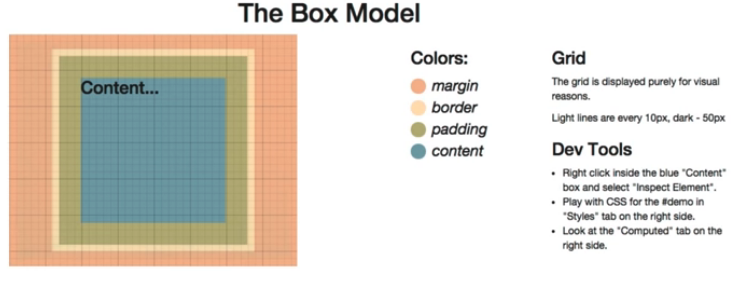
    - [Flexbox](http://css-tricks.com/snippets/css/a-guide-to-flexbox/)
- Images in html
    - ``
- Code, Test, Refine
     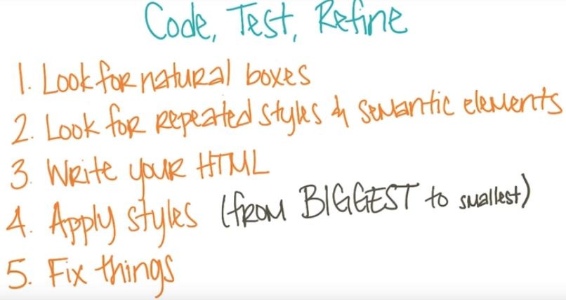
    - use DevTools
        - Note that the changes you make in Dev Tools are temporary. If you want to save them, you must select the source file in the 'Sources' tab, right or control+click on the file you wish to save, select 'Save As' and save the file to the directory that contains the original file. You may want to create a back-up copy of the file before making changes to it.
    - Compare with the Design mockup
- Verifying HTML and CSS
    - [To verify HTML](http://validator.w3.org/#validate_by_input)
    - [To verify CSS](http://jigsaw.w3.org/css-validator/#validate_by_input)

### Css Frameworks, Responsive Layouts
- Grid Design
    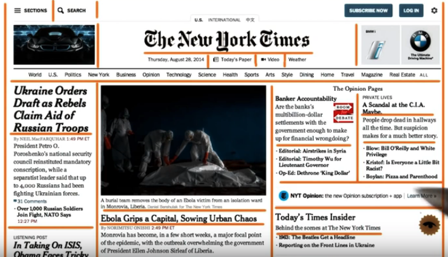   
- CSS frameworks are pre-prepared software frameworks that are meant to allow for easier, more standards-compliant web design using the Cascading Style Sheets language. Most of these frameworks contain at least a grid.
- Responsive Web pages
    - 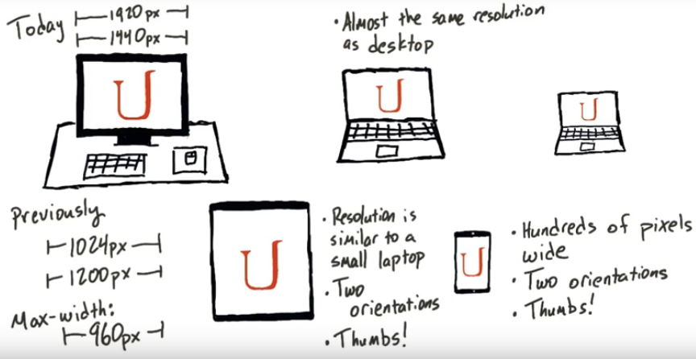
    - Defining the layout
        - 12 columns design
            [see](FWeb_HtmlCss/framework/test.html)
            - in Css

                    .grid {
                        margin: 0 auto;
                        max-width: 1200px;
                        width: 100%;
                    }
                    .row {
                        width: 100%;
                        margin-bottom: 20px;
                        display: flex;
                    }
                    .col-1 {
                        width: 8.33%;
                    }
                    .col-2 {
                        width: 16.66%;
                    }
                    .col-3 {
                        width: 25%;
                    }
                    /* (..) */
                    .col-9 {
                        width: 75%;
                    }
                    .col-10 {
                        width: 83.33%;
                    }
                    .col-11 {
                        width: 91.66%;
                    }
                    .col-12 {
                        width: 100%;
                    }
            - in Html

                    

                        

                        
2 Columns

                        
10 Columns

                        

                        

                        
3 Columns

                        
9 Columns

                        

                    

    - add padding for negative space
    - add margin for space between elements
        
    - `overflow:auto;` for containing text in box
    - use media queries for responsive
        - `@media screen and (min-width: 601px) and (max-width: 992px){...}`
    - Css resetting for browser compatibility
        - [Normalize.css](https://necolas.github.io/normalize.css/)
- Your problem has been solved before !!
    - [stackoverflow](https://stackoverflow.com/)
- Semantic structure
    header, image, form
- test images
    -  placekitten.com and placehold.it 
- check background, colors, fonts
    - [google fonts](http://www.google.com/fonts)
        - add link and css    
            
                <link href="https://fonts.googleapis.com/css?family=Lora" rel="stylesheet">
                
- Code Test Refine
    - 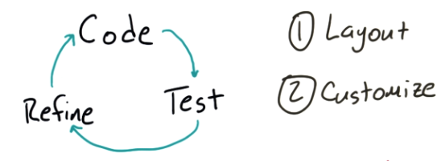

### Bootstrap & Frameworks
- Bootstrap: http://getbootstrap.com/ 
    - Foundation: http://foundation.zurb.com/ 
    - Yaml: http://www.yaml.de/ 
    - 960 Grid: http://960.gs/ 
    - Susy: http://susy.oddbird.net/ 

- Bootstrap [documentation](http://getbootstrap.com/css/)
- select components and download
    - [customize](https://getbootstrap.com/docs/3.3/customize/)
- use min files for deployment
    - You can manually minify your CSS using a site like http://cssminifier.com/.
- Grid systems are used for creating page layouts through a series of rows and columns that house your content. Here's how the Bootstrap grid system works:
    - Rows must be placed within a `.container (fixed-width)` or `.container-fluid (full-width)` for proper alignment and padding.
    - Use `rows` to create horizontal groups of columns.
    - Content should be placed within `columns`, and only columns may be immediate children of rows.
    - 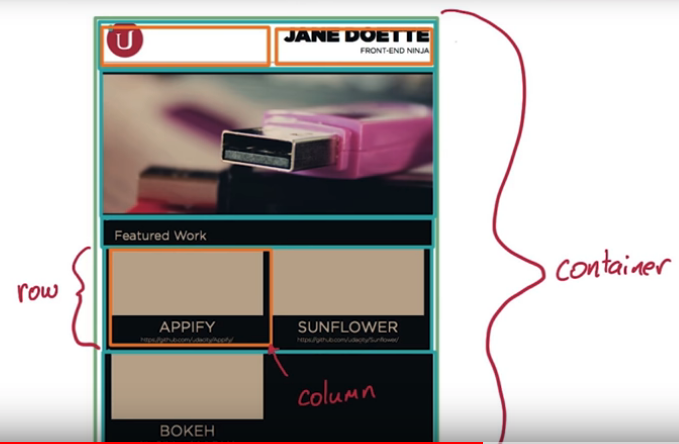
- `<link rel="stylesheet" href="css/bootstrap.min.css">`
-
        <!DOCTYPE html>
        <html>
        <head>
            <link href="css/bootstrap.min.css" rel="stylesheet">
        </head>
        <body>
            

            

                

                    
                

                

                <h1>Jane Doette</h1>
                <h3>Front-end Ninja</h3>
                

            

            

                

                    
                

            

            

        </body>
        </html>
### [Udacity HTML/CSS Style Guide](http://udacity.github.io/frontend-nanodegree-styleguide/)

- Style Guidelines
    - CSS REQUIRED Rules
        - Use consistent **indentation** (tabs or spaces). (See: CSS General Formatting Rules-Indentation)
        - Selectors, properties and property values (with the exception of strings) should be **lowercase**, including letters in hexadecimal color values. For example #f06c13 instead of #F06C13 and #ccc rather than #CCC. (See: CSS-General Formatting Rules-Capitalization.)
        - Use **IDs and class names** that are **meaningful** or generic. (See: CSS-ID and Class Naming.)
        - Use ID and class names that are as **short** as possible but as long as necessary. (See: CSS-ID and Class Naming.)
        - Use **Shorthand properties** in all possible places for margin, border, padding, background. Examples: https://developer.mozilla.org/en-US/docs/Web/CSS/Shorthand_properties. (See: CSS Style Rules-Shorthand Properties.)
        - **Indent block content** between curly braces. (See: CSS Formatting Rules-Block Content Indentation.)
        - End all declarations with a **semicolon**. (See: CSS Formatting Rules-Declaration Stops.)
        - Add **single spaces** after each property name’s colon (See: CSS Formatting Rules-Property Name Stops.)
        - Remove **trailing white spaces** from code. (See: CSS General Formatting Rules-Trailing Whitespace)
        - there should be a single space after each colon. (See: CSS Formatting Rules-Property Name Stops.)
        - Include a single space before the opening curly brace. (See: CSS-Declaration Block Separation.)
        - ID and class names should not be used with type selectors. (See Style Guide: CSS Style Rules-Type Selectors.)
        - Separate style rules with a 
        **blank line**. (See: CSS-Rule Separations.)

    - CSS SUGGESTED Rules
        - Remove units of measure after 0 values. (See: CSS Style Rules-0 and Units.)
        - Use leading zeros for values in the code. (See: CSS Style Rules-Leading 0s.)
        - Use 3 character hexadecimal notation for color in all possible places. For example #ccc rather than #cccccc. (See: CSS Style Rules-Hexadecimal Notation.)
        - Separate words in ID and class names with a hyphen. (See: CSS Style Rules-ID and Class Name Delimiters.)
        - Remove CSS hacks or user detection from code. (See: CSS Style Rules-Hacks.)
        - Separate selectors and declarations with new lines. (See: CSS-Selector and Declaration Separation.)
        - Use double quotes for all attribute selectors and property values. (See: CSS Formatting Rules-CSS Quotation Marks.)
        - Identify groups of related style rules with section comments. (See: CSS Meta Rules-Section Comments.)

    - HTML REQUIRED Rules
        - Element and attribute names should all be **lowercase**. (See: Capitalization.)
        - Use **HTML5**. (See: HTML Style Rules-Document Type.)
        - Use **UTF-8** as character encoding. (See: General Meta Rules-Encoding.)
        - Place all block/list/table elements on a **separate line and indent** child elements. (See: HTML-General Formatting.)
        - Use **semantic tags**. (See: HTML Style Rules-Semantics.)
        - Provide **alternate content** for multimedia. (See: HTML Style Rules-Multimedia Fallback.)
        - Remove **trailing white spaces** from code. (See: HTML - General Formatting Rules - Trailing Whitespace.)
        - Use consistent **indentation** (tabs or spaces) (See HTML - General Formatting Rules - Indentation)

    - HTML SUGGESTED Rules
        - Use **comments** to explain the code. (See: General Meta Rules-Comments.)
        - Mark action items with **TODO**. (See: General Meta Rules-Action Items.)
        - Remove entity references. (See: HTML Style Rules-Entity References.)
        - Remove type attribute from link and script elements. (See: HTML Style Rules-Type Attributes.)
        - Use **double** rather than single **quotation marks** for attribute values. (See: HTML-HTML Quotation Marks.)

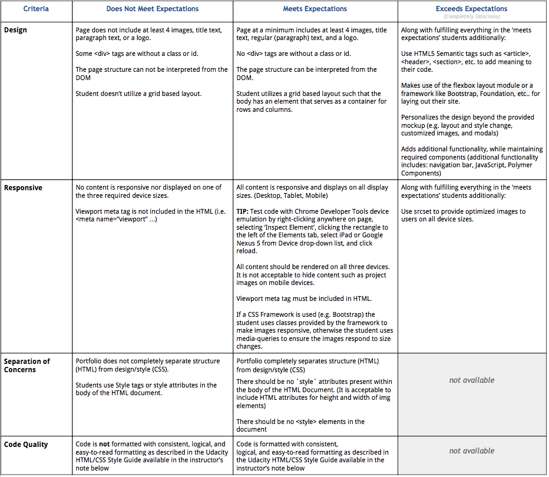

[Table of contents](#table-of-contents)

---
## Responsive Web Design - mws
[Responsive Web Design](#responsive-web-design) - mws

---
## Responsive Images - mws
[Responsive Images](#responsive-images) - mws

---
## Javascript Basics
[Table of contents](#table-of-contents)

---
## Intro to jquery
[Table of contents](#table-of-contents)

---
## Object-Oriented JS
### Scopes
### Closures
### The 'This' Keyword
### Prototype Chains
### Object Decorator Pattern
### Functional Classes
### Prototypal Classes
### Pseudoclassical Patterns
### Superclasses and Subclasses
### Pseudoclassical Subclasses

(...)

[Table of contents](#table-of-contents)

---
## Html5 Canvas
[Table of contents](#table-of-contents)

---
## Website Performance Optimization
[Table of contents](#table-of-contents)

---
## Browser Rendering Optimization
[Table of contents](#table-of-contents)

---
## Intro to Ajax
[Table of contents](#table-of-contents)

---
## JS Design Patterns
***Design professional code with organizational Javascript library or framework***

### Changing Expectation
- Requirements can change
    - scalable?
        - Closures and event listener
        
        // clear the screen for testing
        document.body.innerHTML = '';

        var nums = [1,2,3];

        // Let's loop over the numbers in our array
        for (var i = 0; i < nums.length; i++) {

            // This is the number we're on...
            var num = nums[i];

            // We're creating a DOM element for the number
            var elem = document.createElement('div');
            elem.textContent = num;

            // ... and when we click, alert the value of `num`
            elem.addEventListener('click', (function(numCopy) {
                return function() {
                    alert(numCopy);
                };
            })(num));

            document.body.appendChild(elem);
        };
    - Spaghetti code
- MV O
    - view : user interface
    - model : data
    - octopus : connect view with data 
        - Controller, View Model, Presenter, * ...whatever connects

    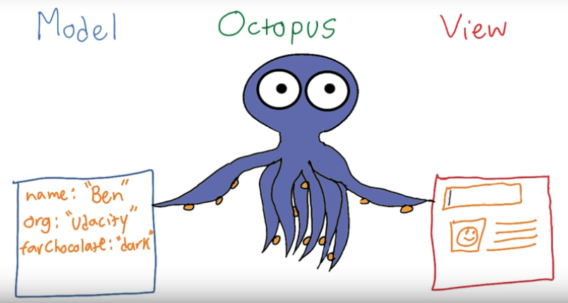
    - keep View and model simple
    - make the Octopus smart

### Refactoring with separation of concerns
- planning
    - separate model from view
    - separate different views
    - see how to connect view and model
- refactoring
    - make it more readable but reordering the code without changing functionality or breaking 'contract'
    - if code too bad replace piece by piece
    - if too spaghetti delete and restart
- take time and plan

### Organizational Libraries
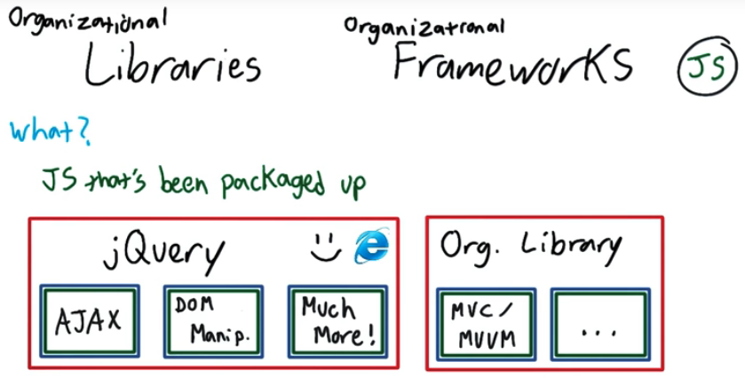
- Library vs Organizational library
    - Library like jQuery 
        - packaged js code functions for easy use
    - Organizational Library MVC/MVVM
        - provide a 'framework' to organize the code
    - Don't reinvent the Wheel
- Organizational Concepts
    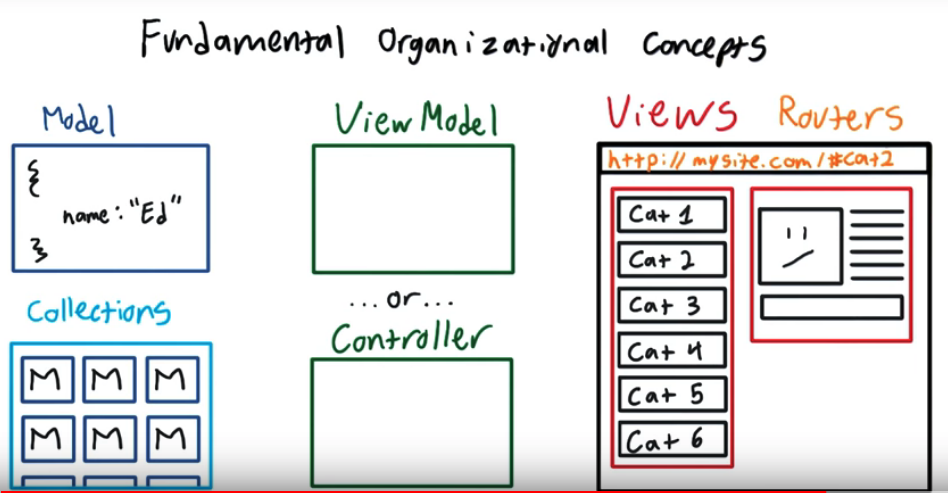
- [Knockout JS](http://knockoutjs.com/)
    - ViewModel: Knockout's ViewModel is similar to the Octopus. It separates the Model and the View

    - Declarative Bindings: Bindings allow you to connect the View and Model in a direct and simple way.
        - through DOM

    - Automatic UI Refresh: Knockout's will update the View when the Model changes. And with the right declarative bindings, Knockout can update the Model when elements in the View change (such as input elements, checkboxes, etc).

    - Dependency Tracking: Knockout allows you to create a relationship between parts of the Model, and will automatically update Model data that depends on other Model data when that other Model data changes.

- console.dir(object) is a function that you can use in modern web browsers to display a list of the properties of the specified JavaScript object.

- Model
    - Observables
        - function to store data and notify viewModel and view when modified
        - `var myNum = ko.observable(5);`

- Documentation
    - look up even the basics
        - things used often will stay in memory... eventually
    - make good documentation for others and your later self       
- An observableArray tracks which objects are in the array, not the state of those objects

        var myObservableArray = ko.observableArray();    // Initially an empty array
        myObservableArray.push('Some value'); // Adds the value and notifies observers

(...)

[Table of contents](#table-of-contents)

---
## JS Testing
[Table of contents](#table-of-contents)

---
## How to use Git
[Table of contents](#table-of-contents)

